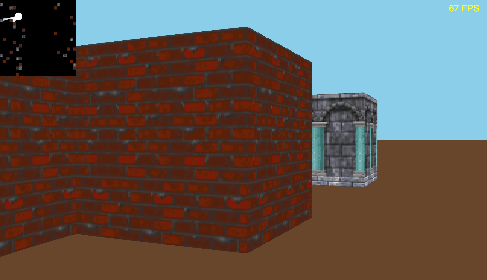

# Raycasting in p5.js

Maybe I will come back to this one day, or recreate it in WebGL, as it gets slow sometimes.

Working:
* Naive raycasting - O(rays * segments)
* Compliance with the MVC pattern
* Segment height and width ratio independent from display size
* Proper rendering of objects of different height
* Texturing

Views:
* 2D level view
* Pseudo-3D first person view
* FPS counter

TODO:
* Collision detection
* Actual levels
* Quadtree clipping to render only visible objects

Move with WSAD, run with left Shift, look around with your mouse. Change views / level size in the setup function.

## Screenshot of the current version:

