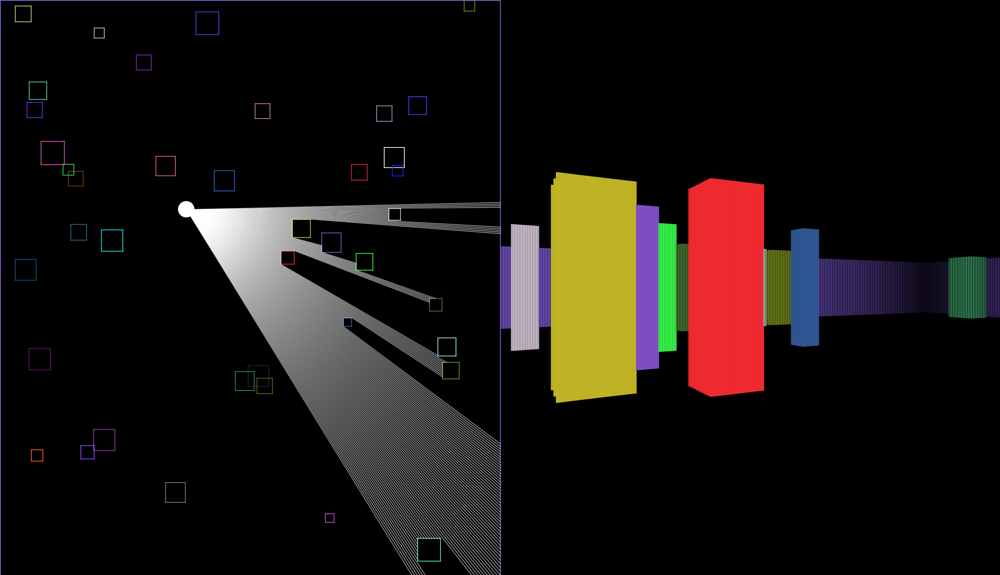

# Non-Euclidean Raycasting

WORK IN PROGRESS

Working:
* Raycasting
* Pseudo-3D rendering
* Basic ground and sky

Move with WSAD, run with left Shift, look around with your mouse.

## Screenshot of the current version:

