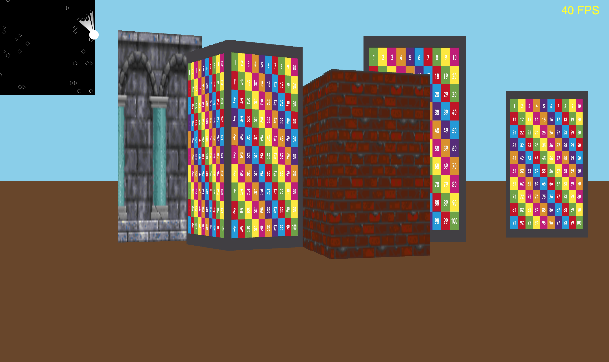

# Non-Euclidean Raycasting

WORK IN PROGRESS

Working:
* Naive raycasting - O(rays * segments)
* Compliance with MVC pattern
* Segment height and width ratio independent from display size
* Proper rendering of objects of different height
* Texturing

Views:
* 2D level view
* Pseudo-3D first person view
* FPS counter

Move with WSAD, run with left Shift, look around with your mouse. Change views / level size in the setup function.

## Screenshot of the current version:

